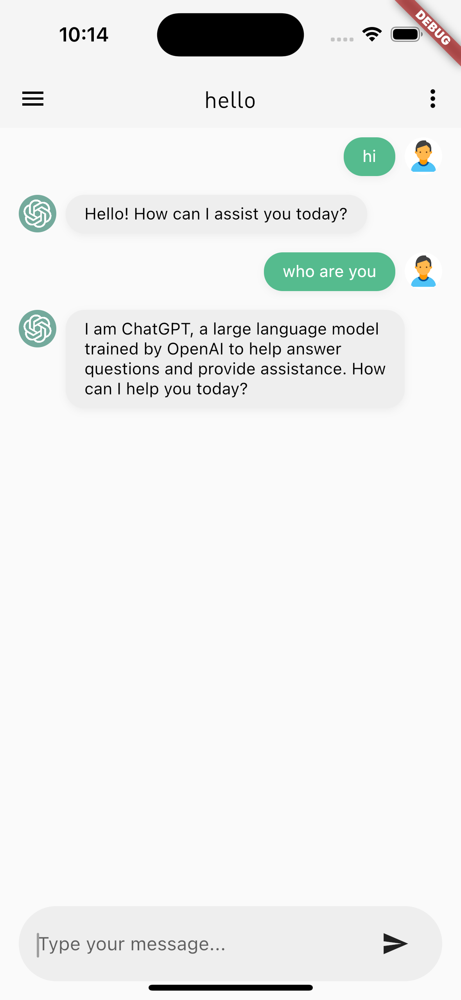
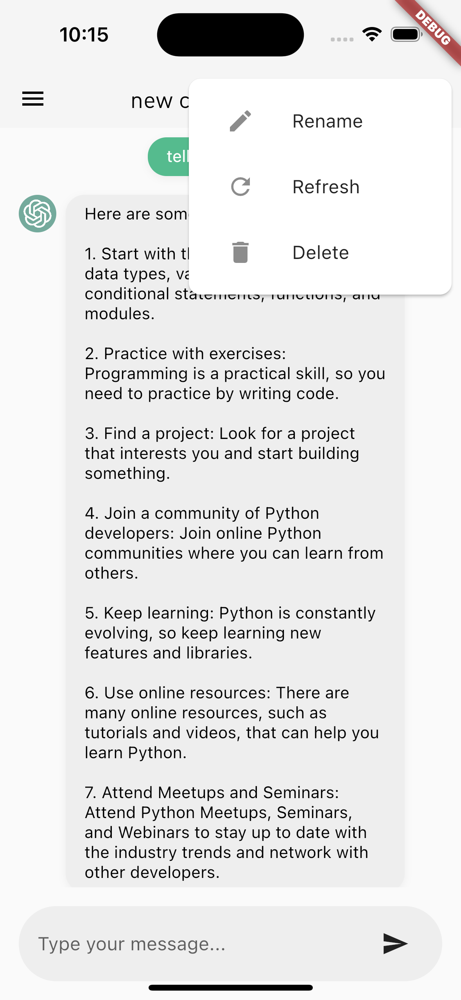

# Simple Flutter Version ChatGPT

Created by Chenran(cn257@cornell.edu)

Refactored by Isaac Chan (isaactinghong@gmail.com)

This is a simple version of **chatgpt in flutter**, using your own API key. With this app, you can chat in app with chatgpt.

|                            |                            |                            |
| -------------------------- | -------------------------- | -------------------------- |
|  |  |  |

## Features

The app includes the following features:

- Chat with ChatGPT using the OpenAI API
- Display chat history
- Add new conversations
- Rename existing conversations
- Delete conversations
- text field multiline
- api key storage
- conversations auto save and load
- selectable conversation text
- auto scroll to bottom during message
- focus on text field after send
- loading spinner
- json serializable
- auto rename conversation topic
- scroll to bottom button
- gpt model changable (New!)

## Auto Distribution

## Getting Started

### Prerequisites

Before you start, make sure you have the following:

- Flutter installed on your machine
- An API key for the OpenAI ChatGPT language model. You can apply for an API key here.

### Installation

Clone the repository to your local machine.
Run the app on your device or emulator using flutter run.
You will also need the Xcode to simulate the ios environment.

'''
flutter run
'''

## TODO

[o] fix Chinese character errors
[o] when click send, messages can be pushed
[o] for Desktop, enter to send message
[o] for Desktop, shift+enter to newline
[ ] other features than chatting... use your creative mind
[ ] deploy to app store

(last updated 2023-03-07)

## License

You can use this project for your own further development! Happy developing and chatting!

## Acknowledgments

The OpenAI API for providing the language model used in the app.
The Flutter framework for making it easy to build beautiful and fast mobile apps.
Credits to Chenran(cn257@cornell.edu).
